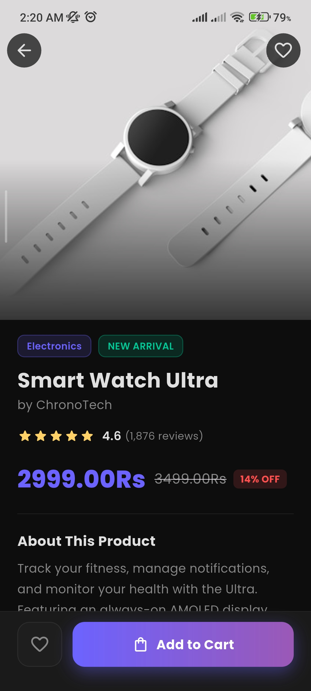
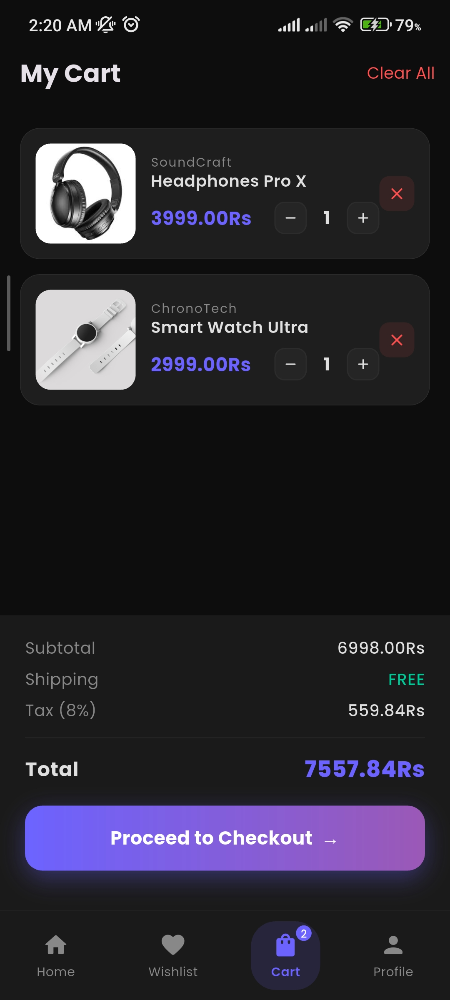
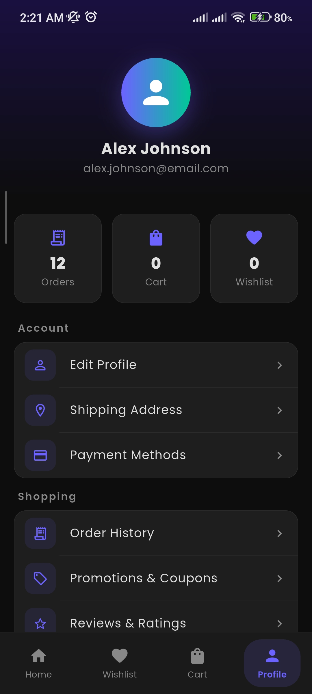

# 🛍️ Shopping E-Commerce App (Flutter)

A modern Flutter-based e-commerce application featuring product browsing, category filtering, cart management, and multi-page navigation flow. This project focuses on UI design, state handling, and structured app navigation.

---

## 🎯 Project Overview

This application simulates a basic e-commerce experience where users can:

- Browse products by categories  
- View product details  
- Add products to cart  
- Manage favorite products  
- View orders  
- Navigate through multiple screens  

---

## 🚀 Features

- Product listing with categories
- Product details page
- Add to cart functionality
- Cart management (add/remove items)
- Favorite products system
- Order page (UI flow)
- Profile page UI
- Smooth navigation between screens
- Clean and responsive UI design

---

## 📸 Screenshots

### 🏠 Home / Product Listing


### 📦 Product Details


### 🛒 Cart Page


### ❤️ Favorite Products


### 📦 Orders Page


### 👤 Profile Page


---

## 🛠️ Tech Stack

- Flutter
- Dart
- Material Design
- State Management (setState / basic logic)

---

## 🧠 Key Concepts Used

- Multi-screen navigation
- State management (basic)
- Product filtering by categories
- Cart logic implementation
- UI/UX design principles

---

## 📂 Project Structure


lib/
├── main.dart

---

## ⚙️ Installation & Run

Clone the repository:

```bash
git clone https://github.com/umar763465/flutter-shopping-app.git

Navigate to project folder:
cd flutter-shopping-app

Install dependencies:
flutter pub get

Run the app:
flutter run
```

## 🎯 Future Improvements
- Add Firebase backend integration
- Add authentication system
- Add payment gateway UI
- Improve state management (Provider / Bloc)
- Add real API-based products
- Add animations for cart & transitions

## 👨‍💻 Author

# Umar
Flutter Developer | BSCS Student
